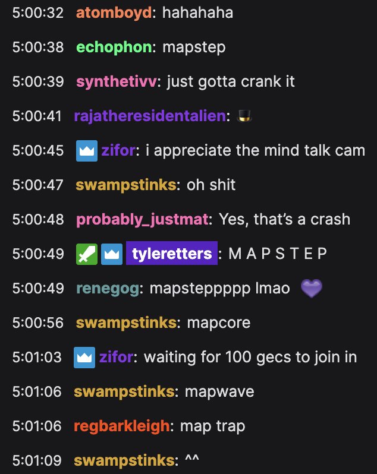
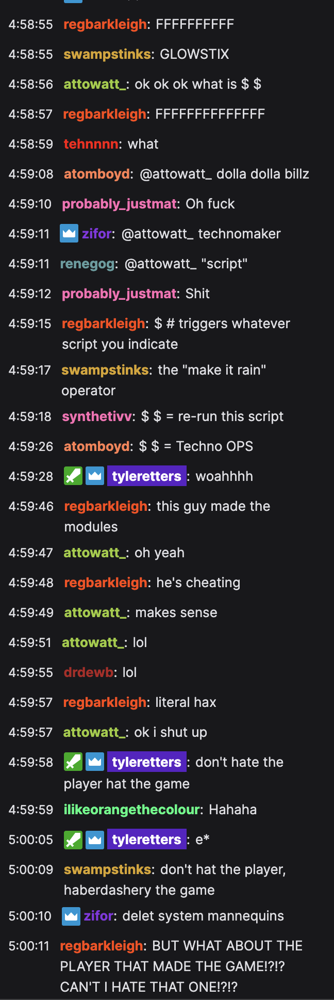

# "Mapcore is whatever you make while finding your way." - `@reg.barkley`

# "I have been thinking about mapcore a lot."

Some thoughts from `@nonverbalpoetry`:

 - If programming your music reveals a bug in your chosen platform, it's mapcore.
 - Mapcore is anything made on the new MacBook wet.
 - You can't dance to mapcore, but you can bop to it.
 - If your rhythum or melody is wonky, because of math, that's mapcore.
 - "It's a weird interval, but I think it's pretty."
 - "I swear this patch worked last time I tried it." (The first working patch was not mapcore.)

# An Attempt to Identify Formal Elements of Mapcore

`@tyleretters`:

 - Traceability: virology of a timbre.
 - Otherness: Sapir-Whorf harmonics.
 - Emergence: ...then there were two, and the awareness of two became a third...
 - Coupling: "Yeah, that variable, `A`? It does six things."
 - Ibid: In the same place.
 - Recursive: *insert meta-recursive joke*.

# Etymology

The term "mapcore" was coined on June 5th, 2021 by `@echophon` and `@swampstinks` during the Islands of Stability performance at [Flash Crash 210605](https://flashcrash.net). Other viable names are:

 - mapstep
 - mapwave
 - maptrap

"Map," of course, comes from the [Maps with Trent](https://llllllll.co/t/31528) series.

# `DEL M: $ $`

[4 hours, 58 minutes, and 46 seconds](https://www.twitch.tv/videos/1046928056) into Flash Crash, Trent dropped the `DEL M: $ $`. Chat's response could be summed up with this gif:

Chat was quick to realize what was going on:

